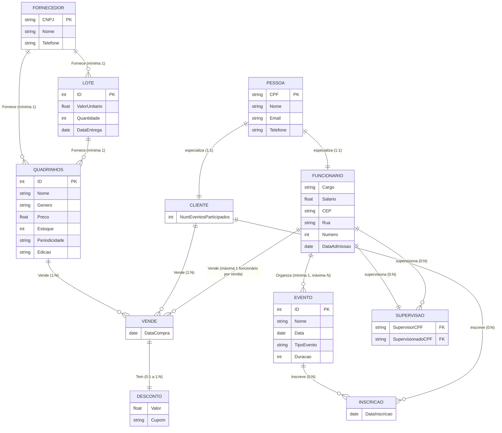

# 📈 Diagrama ER – AV2 (será atualizado a cada entrega)

Este documento apresenta o diagrama ER em **Mermaid** utilizado para a **Avaliação AV2** do projeto **Comic Center** na disciplina **Gerenciamento de Dados e Informação – UFPE**.

O diagrama foi revisado e modificado de acordo com o **feedback da AV1**, garantindo que todos os requisitos mínimos foram atendidos e que as correções foram aplicadas.

---

## ✅ Requisitos mínimos atendidos e explicações

- **Mínimo de 4 entidades regulares:** Cumprido com as entidades **PESSOA, FUNCIONARIO, CLIENTE, QUADRINHOS, EVENTO, LOTE, FORNECEDOR**.
- **Entidade fraca:** Cumprida com a entidade **DESCONTO**, que depende da entidade associativa **VENDE**.
- **Entidade associativa:** Cumprida com **VENDE** representando o relacionamento triplo entre Funcionário, Cliente e Quadrinhos.
- **Auto-relacionamento:** Cumprido com **SUPERVISAO**, indicando a relação de supervisão entre funcionários.
- **Relacionamento temporal:** Cumprido com **INSCRICAO**, onde a data de inscrição é registrada.
- **Especializações:** Cumpridas com a relação de especialização de **PESSOA** para **FUNCIONARIO** e **CLIENTE**.
- **Relacionamento triplo:** Cumprido explicitamente com a entidade associativa **VENDE** conectando **FUNCIONARIO, CLIENTE e QUADRINHOS**.

---

## 🔧 Modificações feitas de acordo com o feedback da AV1

- Corrigida a **cardinalidade mínima de ORGANIZA** (mínima = 1 funcionário).
- Corrigida a **cardinalidade mínima do relacionamento triplo FORNECE** (mínima = 1:1:1).
- Corrigida a **descrição de DESCONTO** e sua vinculação à entidade associativa **VENDE**.
- Ajustada a **máxima do relacionamento triplo VENDE** para apenas 1 funcionário por venda.
- Garantida a **consistência entre minimundo e diagrama**.

---

## 📋 Diagrama ER em Mermaid

---

## 🔗 Links para visualização

- 📄 **Visualizar no Draw.io (diagramas.net)**:  
👉 [Abrir Diagrama](https://viewer.diagrams.net/?tags=%7B%7D&lightbox=1&highlight=0000ff&edit=_blank&layers=1&nav=1&title=Diagrama%20ER&dark=auto#Uhttps%3A%2F%2Fdrive.google.com%2Fuc%3Fid%3D1z9cHzAu5elWG1Sr_yfaFSnkrfjwySuP5%26export%3Ddownload)

- 📝 **Editar no Mermaid Live Editor**:  
👉 [Abrir no Mermaid Live Editor](https://mermaid.live/edit#pako:eNqdVs1ym0gQfpXOVKVKrsIuCSu2zE0FaJdNDARsH7Z0mRJjZWphhsyAK4ntY_IAOeeSU0573Cfwm-RJdgaQhARyVNFJNP11f9M_H3OPFjwhyEJEOBQvBc7mDNTv5UuIyPuSSlpwyJ7-ZTTjFrisoAlOiARBlmWKhfo3CN04DqYGzK592wv8aeQFBthvPNe_cg14ez11Is__M4gNcG-UTb18E-g3syDyXdt1guhonfPnt89wWWeDhMAYSE_GY7DLLBc04S9qYM0A7usn_ZOFoGwJdjiD8HXH7POMdIxuhmnasV6RlNxy1rg_zln9p3XWvrRYLPnGeptyXECMFXvKu85u2LFFJd7YKCvALzMiWtgEFwQcXOBpklEpMd_h15S_za0J496pknIZYlHQBc1xwuUOdtOxXbjnHFzNPwjbIlzXIBRkwbdjurLg78tug...)

---

## 📌 Observação

Este diagrama está pronto para visualização em plataformas que suportam Mermaid ou Draw.io.  
Fique à vontade para abrir uma issue ou sugestão de melhoria!

---
