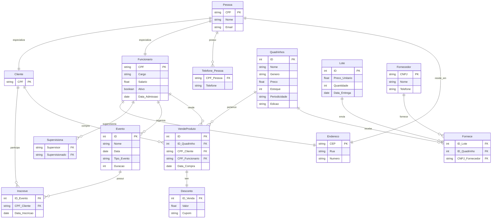

# 📈 Diagrama ER – AV2 (será atualizado a cada entrega)

Este documento apresenta o diagrama ER em **Mermaid** utilizado para a **Avaliação AV2** do projeto **Comic Center** na disciplina **Gerenciamento de Dados e Informação – UFPE**.

O diagrama foi revisado e modificado de acordo com o **feedback da AV1**, garantindo que todos os requisitos mínimos foram atendidos e que as correções foram aplicadas.

---

## ✅ Requisitos mínimos atendidos e explicações

- **Mínimo de 4 entidades regulares:** Cumprido com as entidades **PESSOA, FUNCIONARIO, CLIENTE, QUADRINHOS, EVENTO, LOTE, FORNECEDOR**.
- **Entidade fraca:** Cumprida com a entidade **DESCONTO**, que depende da entidade associativa **VENDE**.
- **Entidade associativa:** Cumprida com **VENDE** representando o relacionamento triplo entre Funcionário, Cliente e Quadrinhos.
- **Auto-relacionamento:** Cumprido com **SUPERVISAO**, indicando a relação de supervisão entre funcionários.
- **Relacionamento temporal:** Cumprido com **INSCRICAO**, onde a data de inscrição é registrada.
- **Especializações:** Cumpridas com a relação de especialização de **PESSOA** para **FUNCIONARIO** e **CLIENTE**.
- **Relacionamento triplo:** Cumprido explicitamente com a entidade associativa **VENDE** conectando **FUNCIONARIO, CLIENTE e QUADRINHOS**.

---

## 🔧 Modificações feitas de acordo com o feedback da AV1

- Corrigida a **cardinalidade mínima de ORGANIZA** (mínima = 1 funcionário).
- Corrigida a **cardinalidade mínima do relacionamento triplo FORNECE** (mínima = 1:1:1).
- Corrigida a **descrição de DESCONTO** e sua vinculação à entidade associativa **VENDE**.
- Ajustada a **máxima do relacionamento triplo VENDE** para apenas 1 funcionário por venda.
- Garantida a **consistência entre minimundo e diagrama**.

---

## 📋 Diagrama ER em Mermaid

---

## 🔗 Links para visualização

- 📄 **Visualizar no Draw.io (diagramas.net)**:  
👉 [Abrir Diagrama](https://app.diagrams.net/?splash=0#G1z9cHzAu5elWG1Sr_yfaFSnkrfjwySuP5#%7B%22pageId%22%3A%22MDzwoyZKB1G08Y7-jSuO%22%7D)

- 📝 **Editar no Mermaid Live Editor**:  
👉 [Abrir no Mermaid Live Editor](https://mermaid.live/edit#pako:eNqVVm2PmkAQ_itkk37zLodveH4ziqmtBxycfmhMyBb2cFPY5RYw7an_vbu8uSDG9ouR2Wdmntl5ZuAIPOojMAWILTAMGIx2ZEcUxdIdx5wpR_FfUZKUYRIoc2upWN8bJkIj1DCgCOKwYUlxTN0YJQmFzWi6pSzzaOcip24sdFufm-2sHNfKyrJmKJJFiFEp1Ju-1pemobu36nCtnFBJ4MIVheidEiSFWm6M-co0ZvbK7AizzIiHKYEMU06y147nQRbQwuIjD0cwVBIYCnRh_ElpiCBRYIoPFQ6mSPxAF_oRThIo1_W6mS3slfHVdCoumKTKanG3LQEi5Q1dmMQMefQSBSUp_ciabjHiVH3sYR_6rT5za4OavtWNN_NfadVVXksFHRBJacPuZwyW2WobZQEk-BP6lDVltBU6smxzsblJp3h0XzPo81h72m5bu7Mdx_MQc5qoPrq0zaNRzKBEaKE7c_Pqblxepg8boqkac4AhZU0dZTGNpJBr802_UVsjiJsRnF7kJqAfGSSp1M8LcR-5vCSGApn80rQNfa4vTLutfsP6dld2HfO0Mpy5vW2xL5v-fxeNSeKxlgpLuq3oayoFuNt8Xpi7pIwgD12Jy9lYur1dOWIjdKwDJ-MTc8BJ7dZ5KmTl02bgL18UW1_P8lXzIibJkdbw6fTwQE-XBTlVYpokGW5DjleLT0bKm0zATyelRu0R86E0xuW57DJVduAydG7MJQqu5u1Mcz9pTwk3IXV0G93Ogt5Rmt3NUXPfgWLkZId65spCGgGEC4xDLh3ugqLCo9Jl6VDeg4DmOuMC7cTJLAqllrrkKwxcKeZGwYkkjMKr0nGZJZ93gQy5kjsRrRv_qNTdCZaGWoDfa7ELNOiBgGEfTFOWoR7gb1b-SuePIJf7DqR7xKccCEcfsl_C5cx9Ykh-UBpVboxmwb56yGIxteUHRo0QomBzmpEUTFV1nIcA0yP4zR-1x_6Tpj5rY22gqYOJOuyBP2D60B8_as_DyWTYHz4PJkN1dO6Bzzyr-vikjfvj0Wgy0IbjiTqa9AB_R6WUvRQfOPl3zvkvzl3U8g)

---

## 📌 Observação

Este diagrama está pronto para visualização em plataformas que suportam Mermaid ou Draw.io.  
Fique à vontade para abrir uma issue ou sugestão de melhoria!

---
